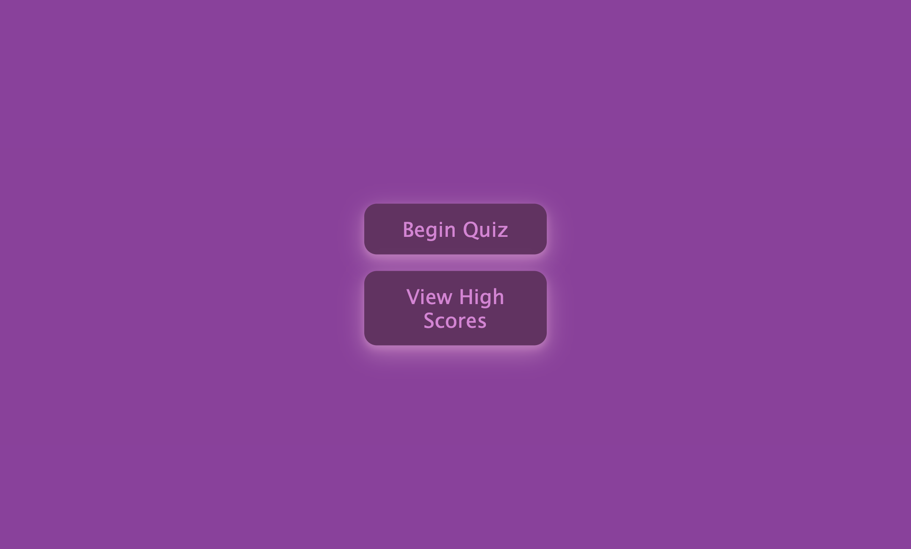
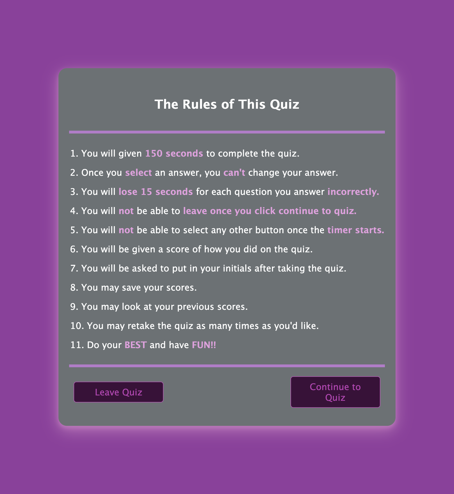
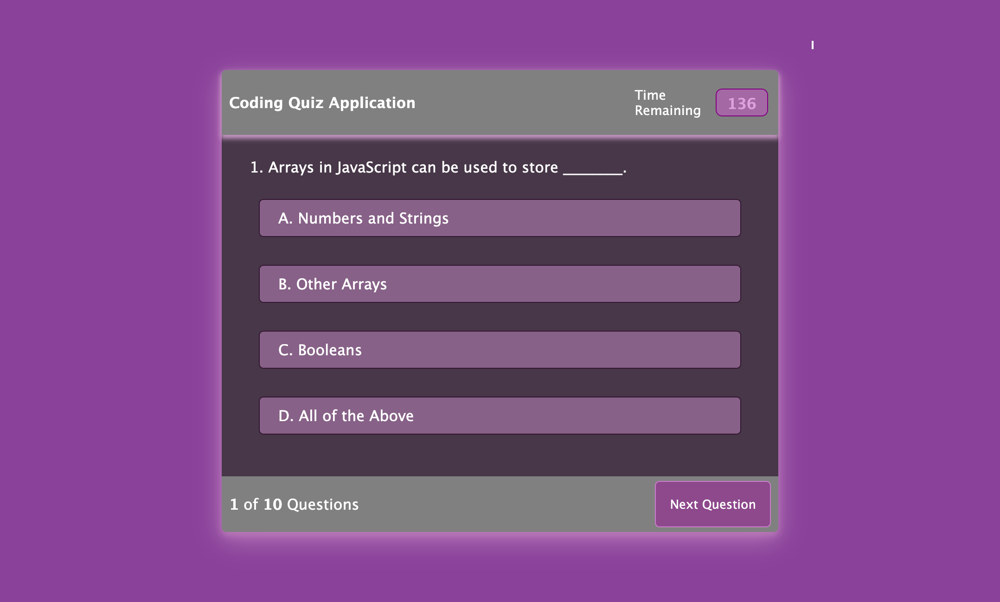
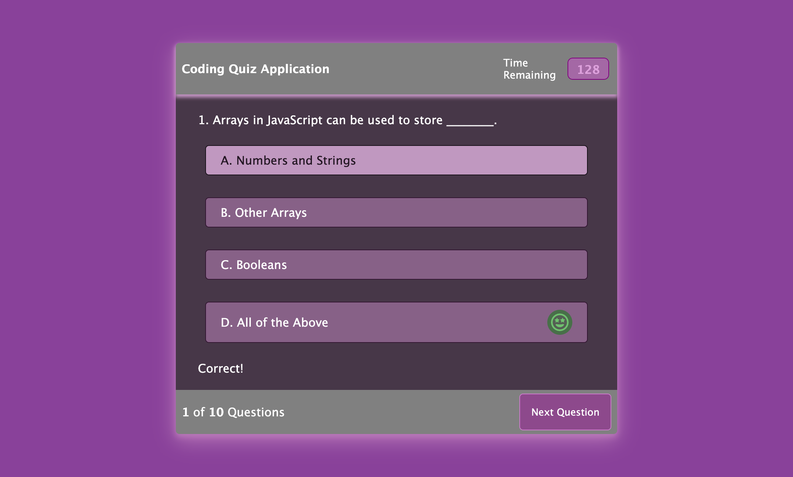
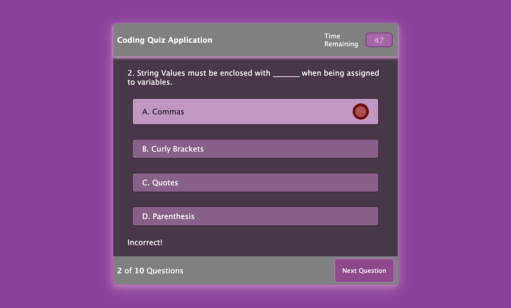
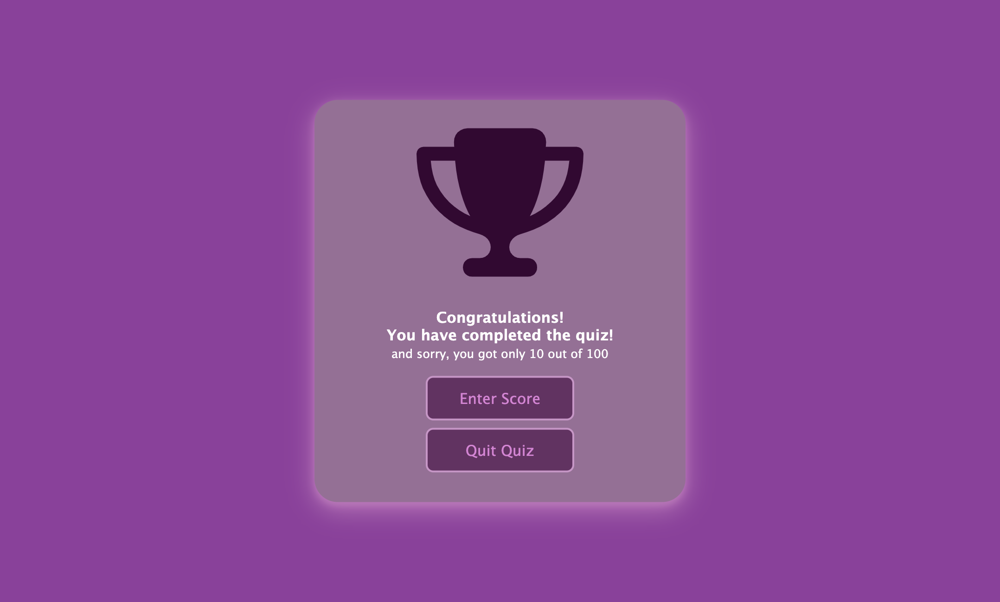
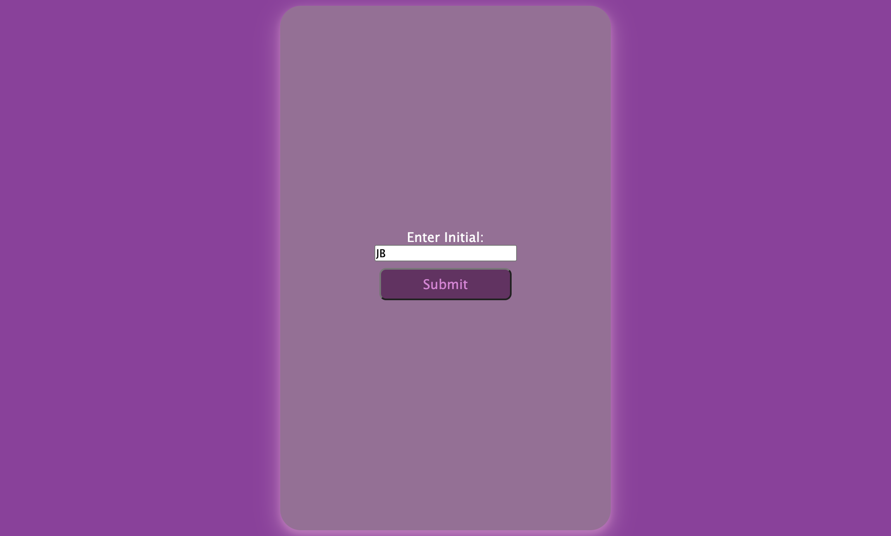
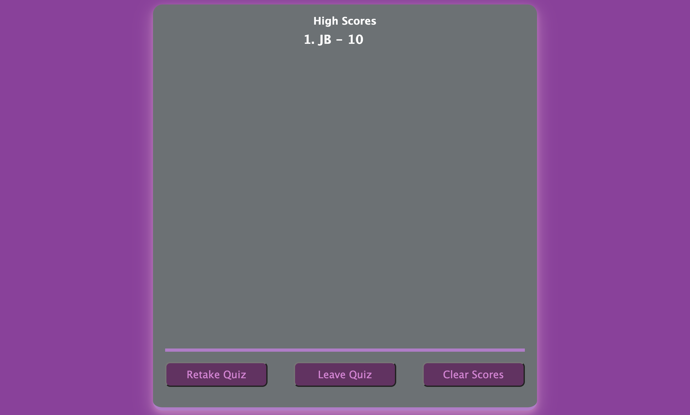
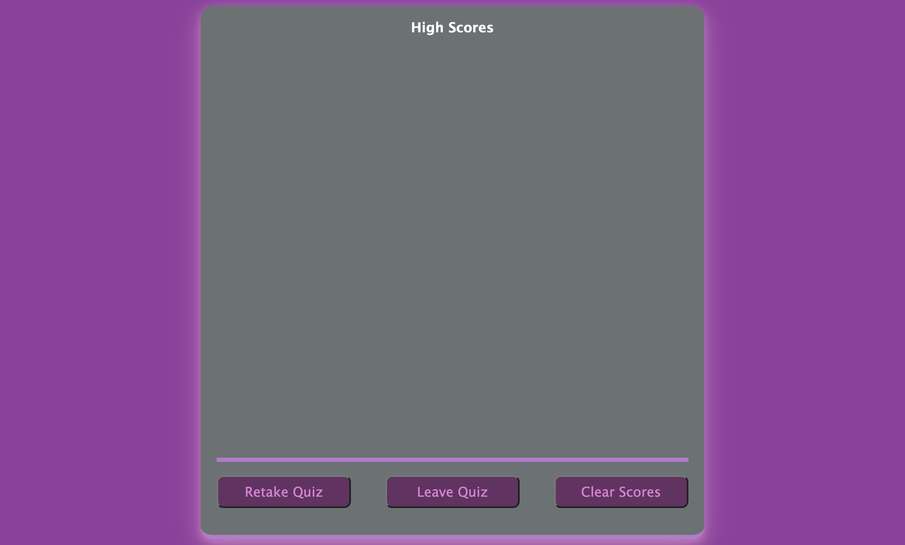

# Web-APIs-Challenge-Code-Quiz
Homework Challenge #4

## Project Description
Creating a code quiz using vanilla javascript was quite challenging. This was by far the most difficult assignment that I had worked on. I first started off with having one html file, one css file, and one js file then was struggling on how to have my questions show on the js file. So, I created multiple files for html, css, and js. I then struggled how to link up all those files together. So, I went back to having one html, one css, and js. I had a lot of help from a tutor to guide me through this homework assignment. I was motivated to create my own coding quiz, so that I can take the quiz myself and continue to challenge myself by keep trying the quiz until I get all the answers correct. I not only did it for myself, but for any user that would like to take the quiz and challenge themselves. They also have the option to take the quiz against their peers and friends. The user my retake the quiz and save their scores as many times as they'd like. They can compare scores if they play it against their peers and/or friends. My live page can be seen in the <a href="#Table of Contents">Table of Contents</a> section. This challenge homework not only helped me improve on my vanilla javascript skills, but it also helped me continue to improve on my HTML and CSS skills. In addtion, this helped ,me work on my responsive layout skills. I made the quiz, so that it is user friendly for all devices, such as laptop, mobile, and tablets. This was a challenging assignment, yet also fun. It was challenging to use vanilla javascript which will also be very useful in the future. You can <a href=https://github.com/hannybear88/Web-APIs-Challenge-Code-Quiz>Click here</a>  to see my code for this project. 

<>
## Table of Contents
<nav>
    <ol>
        <li><a href="#How to Use this Project">How to Use this Project</a></li>
        <li><a href="#Support">Support</a></li>
        <li><a href="#Credits">Credits</a></li>
        <li><a href="#Contributors">Contributors</a></li>
    </ol>
</nav>

## How to Use the Project

<a href=https://hannybear88.github.io/Web-APIs-Challenge-Code-Quiz/>Click here</a> to be directed straight to the deployed application

AS A coding boot camp student
I WANT to take a timed quiz on JavaScript fundamentals that stores high scores
SO THAT I can gauge my progress compared to my peers

GIVEN I am taking a code quiz
WHEN I click the begin quiz button

THEN I am directed to the the quiz rules page
WHEN I click on the continue quiz button
 

THEN a timer starts and I am presented with a question
 

WHEN I answer a question
THEN I am presented with another question
 

WHEN I answer a question incorrectly
THEN time is subtracted from the clock
 

WHEN all questions are answered or the timer reaches 0
THEN the game is over
WHEN the game is over
 

THEN I can save my initials and score
 
 

WHEN I click submit to save my initials and score 
THEN I can clear my scores or retake the quiz to get a better score.
Note: I don't have to clear my scores to retake the quiz. That is up to the user. 
 

Here are 3 videos of how the quiz works. You can see that they each show when the user answers the questions correctly or incorrectly, they can enter their initials at the end fo the quiz, save their scores, view their highscores and retake the quiz again as many times as they'd like. These videos also show that they have a responsive layout to laptops, mobiles, and tablets. 

Here is video for when the quiz is play on a laptop.
 

Here is a video on when the quiz played on a tablet. 
 

Here is a video on when the quiz is play on a mobile. 
 

## Support
If you need extra support feel free to <a href="mailto:hannahkchung88@gmail.com">email me</a>

## Credits
Hannah Chung

## Contributors

Code by Hannah Chung
