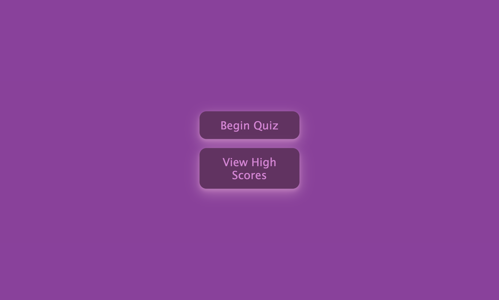
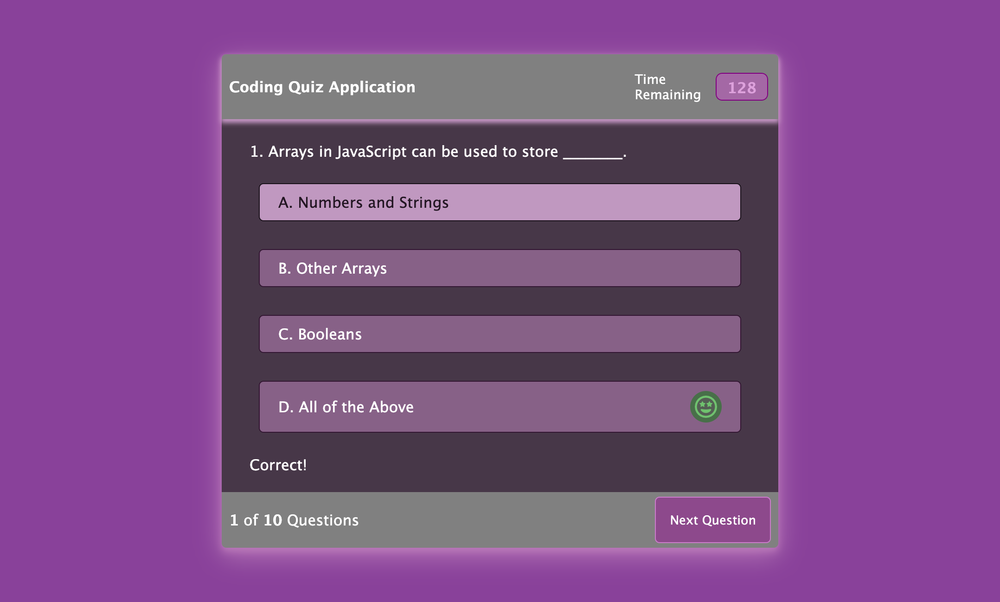
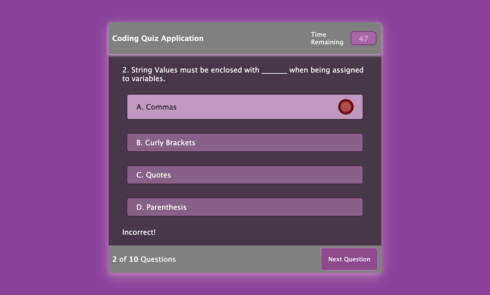
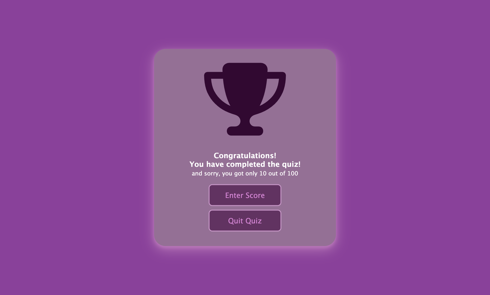
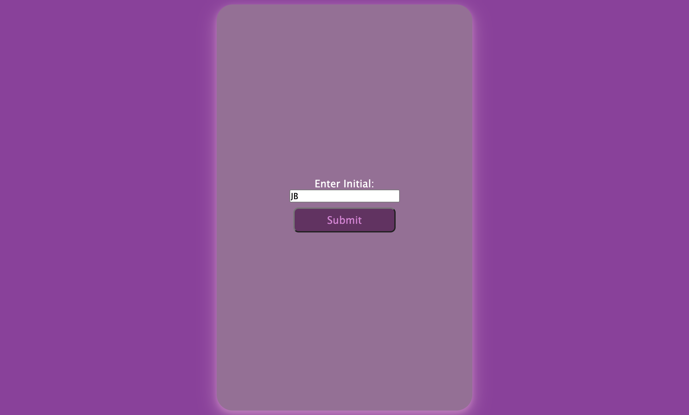
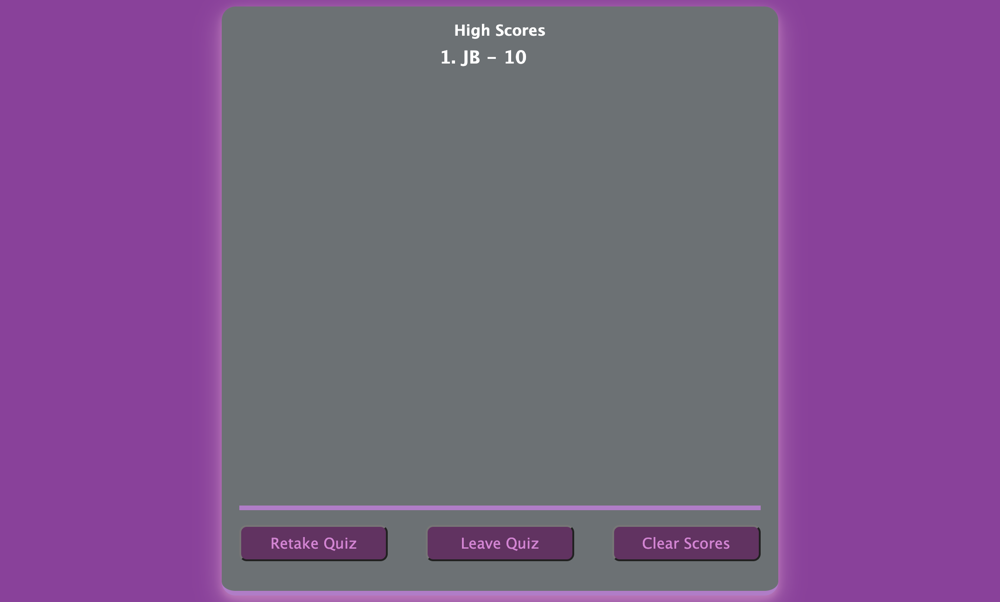
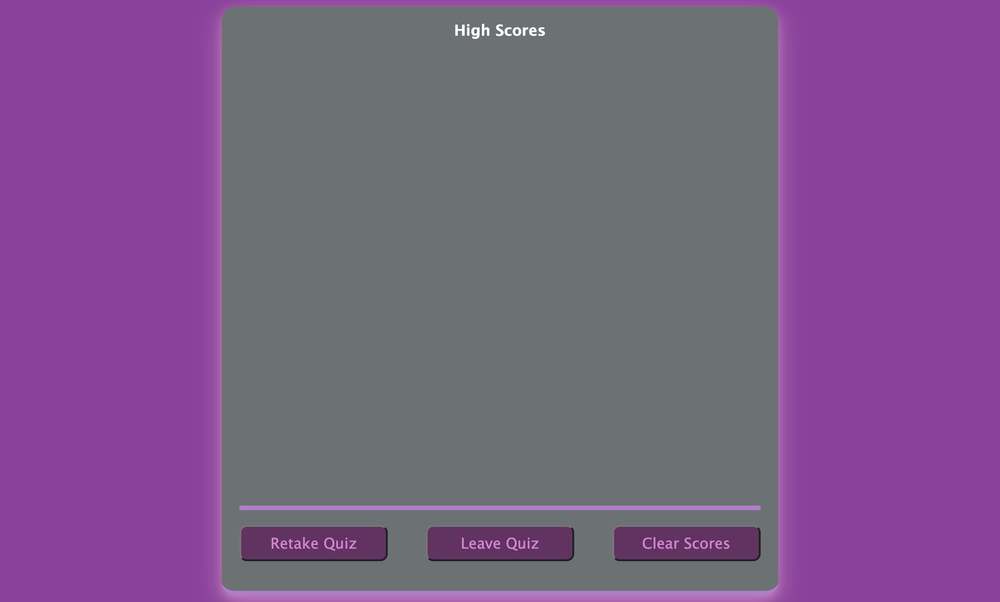

# Web-APIs-Challenge-Code-Quiz
Homework Challenge #4

## Project Description
Building a professional portolio was our second homework challenge by using both HTML and CSS. I was motivated to create my own professional portfolio so that when I build one that I use then I will have a better idea on how to build one and how I'd like for it to look. My live page can be seen in the <a href="#Table of Contents">Table of Contents</a> section. It helped me imporve both on my HTML and CSS skills. This assignment also helped us build so that it is user friendly for all devices, mobile and tablets. This was a challenging assignment, yet also fun. It was challenging to use flex-box which will also be very useful in the future. You can <a href=https://github.com/hannybear88/Web-APIs-Challenge-Code-Quiz>Click here</a>  to see my code for this project. 

## Table of Contents
<nav>
    <ol>
        <li><a href="#How to Use this Project">How to Use this Project</a></li>
        <li><a href="#Support">Support</a></li>
        <li><a href="#Credits">Credits</a></li>
        <li><a href="#Contributors">Contributors</a></li>
    </ol>
</nav>

## How to Use the Project

<a href=https://hannybear88.github.io/Web-APIs-Challenge-Code-Quiz/>Click here</a> to be directed straight to the deployed application

 
 
 
 
 
 
 
 

## Support
If you need extra support feel free to <a href="mailto:hannahkchung88@gmail.com">email me</a>

## Credits
Hannah Chung

## Contributors
<ul>
    <li>Code by Hannah Chung</li>
</ul>
